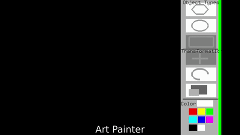

# CIS-81-3D-Graphics - Projects
First we'd read about topics and concepts in graphics programming, then we'd write programs from scratch, using the C++ library [FreeGLUT](http://freeglut.sourceforge.net/). This was one of the harder classes I've taken.

Here's a video of my last two projects:

This video includes a vector-based drawing program. I made the entire from scratch, including its GUI.

The second part of the video shows a program I wrote that renders fractal trees on a randomly generated landscape.

# Videos

**Assignment 1**  
[https://www.youtube.com/watch?v=lbacXxiY0h8]

**Assignment 2**  
[http://joeburger.ax.lt/colorWheel.webm]

**Assignments 4 & 5**  
*Assignment 4 is assignment 3 with a toggleable 3D viewing mode*  
[https://www.youtube.com/watch?v=qWRyt30dobI]
